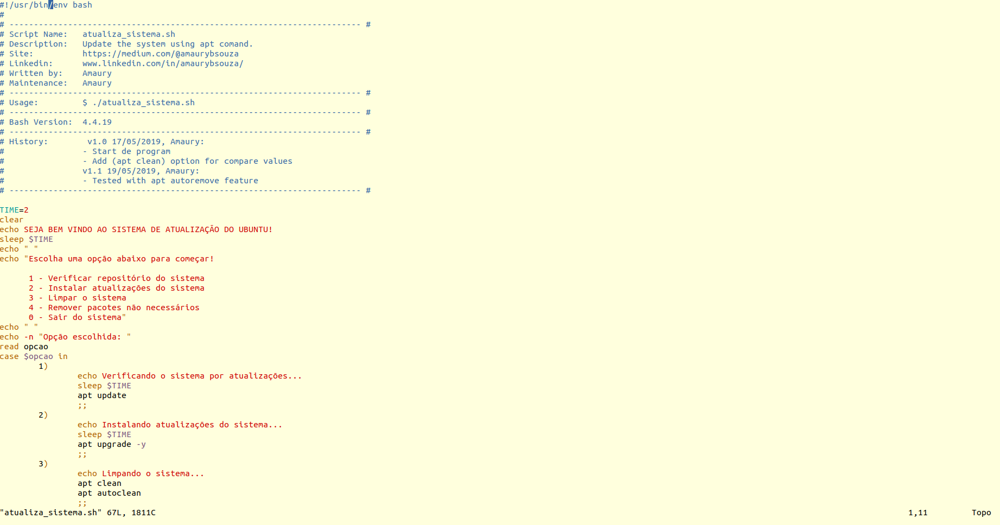

## Mostrando o uso básico de Shell Script

- Editor usado: VIM (versão 8.0.1453). Para saber mais detalhes do VIM, acessa esse link aqui: [VIM](https://github.com/amaurybsouza/LPIC1-Linux_Administrator/blob/master/Exame%20101/Topic%20103:%20GNU%20and%20Unix%20Commands/103.8%20Perform%20basic%20file%20editing%20operations%20using%20vi)
- Vantagens do projeto: uso básico de comandos do shell, automação da infra, loops e condicionais em shell e debug do código.
- Quando usar shell script? Você pode usar sem moderação, o bash é muito poderoso e oferece diversas funcionalidades e para facilitar o dia a dia você pode automatizar as tarefas usando scripts, como por exemplo, um backup automático de um diretório, a instalação de programas, instalação do LAMP, etc.
- Descrição do projeto: abaixo irei mostrar algumas formas de uso de scripts, na qual obtive resultados reais.

### Onde buscar conhecimentos de shell? Na Udemy e de graça! :-)
- Linux Fundamentals for IT Professionals (https://www.udemy.com/linux-fundamentals-for-it-professionals/)
- Intro to Linux Shell Scripting (Free course) (https://www.udemy.com/linux-shell-scripting-free/)
- Conceitos de Programação em Shell Script (https://www.udemy.com/conceitos-de-programacao-em-shell-script/)
- Livro "Programação Shell Linux" - por Julio Cezar Neves.
- Livro "Shell Script Profissional" - por Aurelio Marinho Jargas.

### Argumentos especiais

Argumentos| Descrição
--------- | ----------------------------------------------
   $0     | contém o nome do script que foi executado
   $#     | contém o número de argumentos que foi passado 
   $*     | retorna todos os argumentos de uma vez só
   $$     | PID do processo atual (do próprio script)
   $?     | retorna o valor do último comando executado
   $_     | último argumento do último comando executado.
   

### Comparações númericas

Comparação | Descrição
-----------|--------------------------------
n1 -eq n2  | verifica se n1 é igual a n2
n1 -ge n2  |
n1 -gt n2  |
n1 -le n2  |
n1 -lt n2  |
n1 -ne n2  |

### Como fazer um cabeçalho objetivo? Veja a tela abaixo: :-)

- É sempre importante criar um cabeçalho para seus scripts, pois outras pessoas poderão usar o seu código em projetos futuros, e dessa forma, com o cabeçalho criado, mostrando a forma de se usar o script, facilita o uso.

- Confira na tela uma template de cabeçalho para seu script:

### Loops e Condicionais

1) Instrução if: [verifica_nome.sh](https://github.com/amaurybsouza/Shell-Script/blob/master/CursoShellScript/ScriptsAmaury/TesteIf1.sh), [vai_no_show.sh](https://github.com/amaurybsouza/Shell-Script/blob/master/ScriptsTestes/if3_1.sh), [jogo_secreto.sh](https://github.com/amaurybsouza/Shell-Script/blob/master/ScriptsTestes/jogo_secreto.sh), [verifica_valor.sh](https://github.com/amaurybsouza/Shell-Script/blob/master/ScriptsTestes/verifica_valor.sh), [checa_numero.sh](https://github.com/amaurybsouza/Shell-Script/blob/master/ScriptsTestes/compare.sh), [teste_arquivo.sh](https://github.com/amaurybsouza/Shell-Script/blob/master/ScriptsTestes/dir.sh)

2) Instrução case: [operações.sh](https://github.com/amaurybsouza/Shell-Script/blob/master/ScriptsTestes/operacoes.sh), [atualiza_sistema.sh](https://github.com/amaurybsouza/Shell-Script/blob/master/ScriptsTestes/atualiza_sistema.sh), [instala_programas.sh](https://github.com/amaurybsouza/Shell-Script/blob/master/ScriptsTestes/instala_programas.sh), [status_apache.sh](https://github.com/amaurybsouza/Shell-Script/blob/master/ScriptsTestes/start_apache.sh)

3) Instrução for: [Exemplo1](https://github.com/amaurybsouza/Shell-Script/blob/master/CursoShellScript/ScriptsAmaury/InstrucoesLoop.txt), [Exemplo2](https://github.com/amaurybsouza/Shell-Script/blob/master/CursoShellScript/ScriptsAmaury/InstrucoesLoop2.sh), [verifica_diretorio.sh](https://github.com/amaurybsouza/Shell-Script/blob/master/CursoShellScript/ScriptsAmaury/TesteFor2.sh)

4) instrução while

### Scripts diversos sobre o sistema Linux
A ideia aqui é apresentar um pouco de Shell Script como um meio agradável e simples de automatizar tarefas do dia a dia.
- Script para gerar relatório do sistema: [relatorio_sistema.sh](https://github.com/amaurybsouza/Shell-Script/blob/master/CursoShellScript/ScriptsAmaury/RelatorioMaquina.sh).

- Script simples que mostra um exemplo básico do Case: [teste_case.sh](https://github.com/amaurybsouza/Shell-Script/blob/master/CursoShellScript/ScriptsAmaury/ScriptCase.sh).

- Mostrando a hora atual: [hora_atual.sh](https://github.com/amaurybsouza/Shell-Script/blob/master/CursoShellScript/ScriptsAmaury/HoraAtual.sh).

- Script que soma valores: [operacoes.sh](https://github.com/amaurybsouza/Shell-Script/blob/master/CursoShellScript/ScriptsAmaury/SomaValores.sh)

- Script básico de um menu usando o Case: [menu_case.sh](https://github.com/amaurybsouza/Shell-Script/blob/master/CursoShellScript/ScriptsAmaury/MenuCase.sh)

- Script que gera um relatório de um usuário do sistema: [relatorio_usuario.sh](https://github.com/amaurybsouza/Shell-Script/blob/master/CursoShellScript/ScriptsAmaury/RelatoriodeUsuario.sh)

- Script que mostra um exemplo básico de operações com valores: [valores.sh](https://github.com/amaurybsouza/Shell-Script/blob/master/CursoShellScript/ScriptsAmaury/OperacoesValores.sh)

### Scripts para automatização de rotinas

- Script que faz a instalação do Zabbix Agent 4.0 em sistemas Debian: [ZabbixAgent4.0](https://github.com/amaurybsouza/Shell-Script/blob/master/CursoShellScript/ScriptsAmaury/InstalacaoZabbixAgent.sh)

- Script que faz a instalação do Zabbix Agent 4.0 no sistema CentOS: [ZabbixAgent4.0](https://github.com/amaurybsouza/Shell-Script/blob/master/CursoShellScript/ScriptsAmaury/ZabbixAgentCentos.sh)

- Instalação automática de programas: [Programas Linux](https://github.com/amaurybsouza/Shell-Script/blob/master/CursoShellScript/ScriptsAmaury/Install_Softwares.sh)

- Instalação do LAMP (Apache, MariaDB, PHP): [Lamp_Linux](https://github.com/amaurybsouza/Shell-Script/blob/master/CursoShellScript/ScriptsAmaury/webserver_ubuntu.sh)

- Verificação de informações do hardware/sistema: [Hardware_Machine](https://github.com/amaurybsouza/Shell-Script/blob/master/scripts_novos/hardware_machine.sh)

